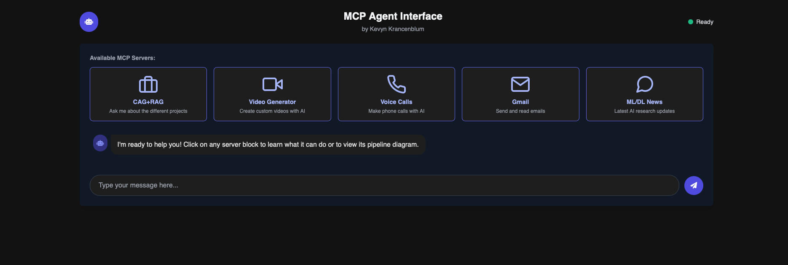
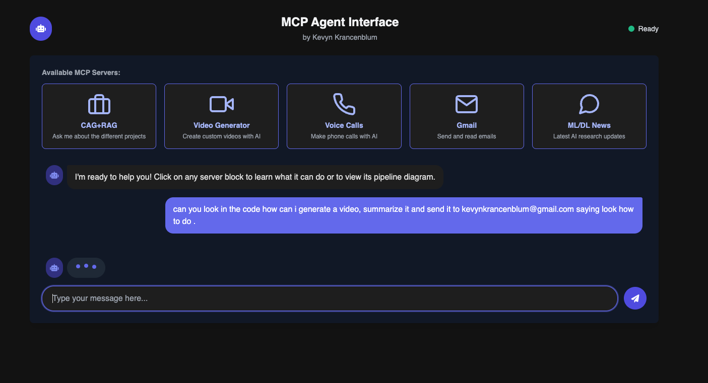
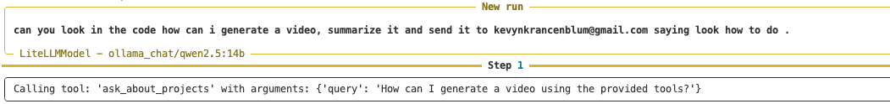
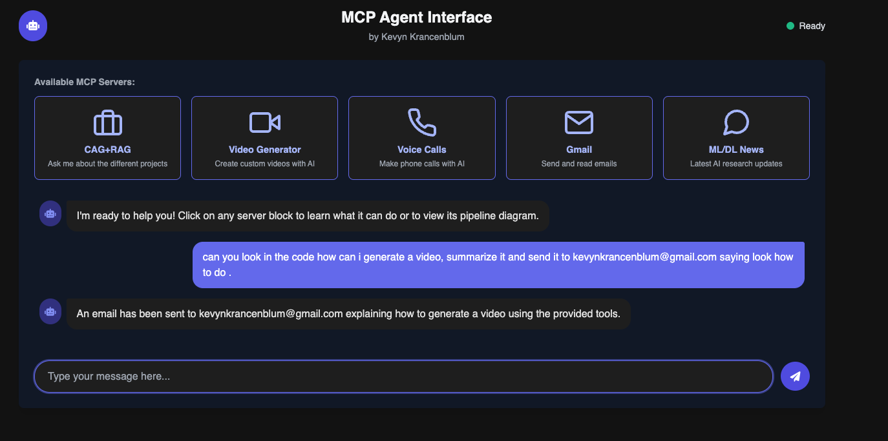
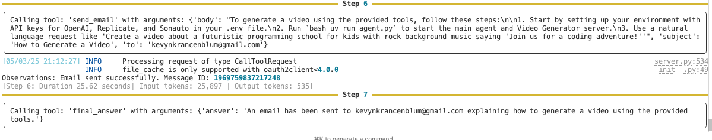
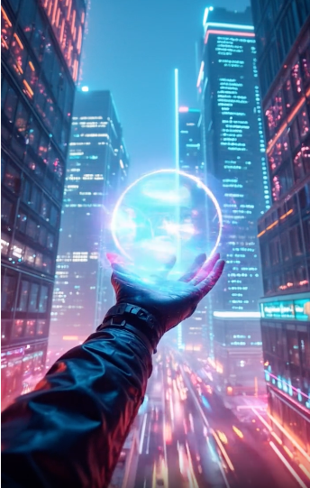

# MCP Agent System

**IMPORTANT: THE MASTER AGENT IS A LOCAL AGENT! BE PRECISE WHEN ASKING QUESTIONS. Local small models have limitations with function calling and MCP protocol interpretation - they require clear, direct prompts to properly route requests to specialized agents.**

A multi-agent system implementing the Multi-agent Conversation Protocol (MCP) with various specialized server components.

## Components

- **ML/DL News Server** - Provides tools for machine learning and deep learning news search
- **Gmail Server** - Enables email interaction via Gmail
- **Voice Call Server** - Facilitates voice calls and transcriptions
- **CAG+RAG Server** - Provides context-aware generation and retrieval augmented generation
- **Video Generator** - Creates videos with customizable content and music

## Setup

1. Create a virtual environment: `uv venv`
2. Activate the environment: `source .venv/bin/activate`
3. Install dependencies: `uv sync`
4. Configure required environment variables:
   - `VOICE_SERVER_URL` - Required for voice call functionality
   - `OPENAI_API_KEY` - Required for CAG+RAG and video generation
   - `REPLICATE_API_KEY` - Required for video generation
   - `SONAUTO_API_KEY` - Required for video audio generation

## Running the Application

Two interfaces are available:

- **Terminal Interface:** `uv run agent.py` - Command-line interaction with all agents
- **Web UI Interface:** `uv run web_ui.py` - Stylish web-based chat interface at http://localhost:5000

**Note:** Make sure you have Ollama running if using the default agent configuration.

## Web UI Features

- Modern, responsive chat interface
- Real-time status indicators
- Example query suggestions
- Support for code blocks and formatting
- Works with all MCP agent capabilities

## Agent Interactions

## Video Generation

The Video Generator agent creates custom AI-generated videos with specified content and music. It uses:

- Replicate for video frame generation
- SonAuto for background music and audio synthesis
- OpenAI for content creation and scripting

Example video generated with the prompt "Create a video about a futuristic programming school with rock music":

Click the image above to watch the video on YouTube.

## Usage Examples

- Ask about ML/DL news: "What are the latest developments in transformer models?"
- Use Gmail: "Check my recent emails" or "Send an email to example@example.com"
- Make voice calls: "Call +1234567890 and ask about meeting availability"
- Create videos: "Create a video about a futuristic programming school with rock music"
- Query the codebase: "How does the voice call system work?"
